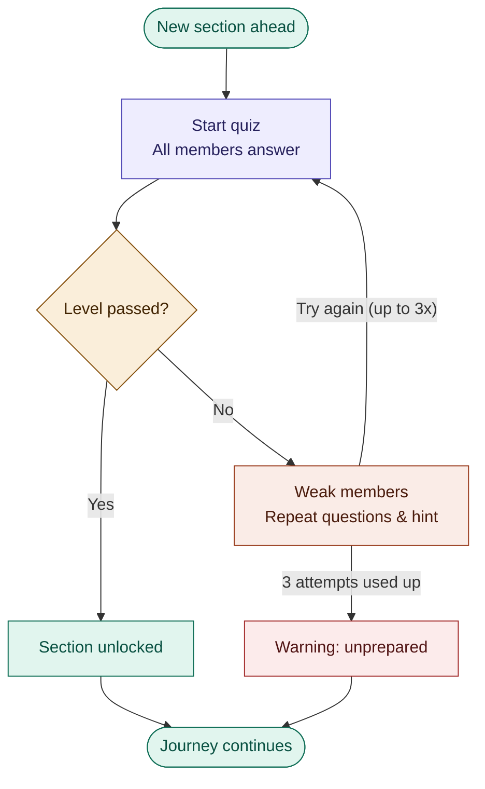

```mermaid
flowchart TD
    A([New section ahead]) --> B["Start quiz<br>All members answer"]
    B --> C{Level passed?}
    C -- Yes --> D[Section unlocked]
    D --> E([Journey continues])
    C -- No --> H["Weak members<br>Repeat questions & hint"]
    H -- Try again (up to 3x) --> B
    H -- 3 attempts used up --> J[Warning: unprepared]
    J --> E
    style A fill:#E1F5EE,stroke:#0F6E56,color:#085041
    style E fill:#E1F5EE,stroke:#0F6E56,color:#085041
    style D fill:#E1F5EE,stroke:#0F6E56,color:#085041
    style B fill:#EEEDFE,stroke:#534AB7,color:#26215C
    style H fill:#FAECE7,stroke:#993C1D,color:#4A1B0C
    style J fill:#FCEBEB,stroke:#A32D2D,color:#501313
    style C fill:#FAEEDA,stroke:#854F0B,color:#412402
```

